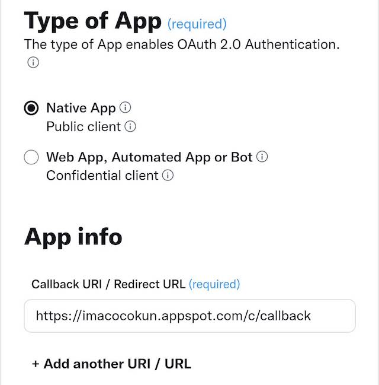
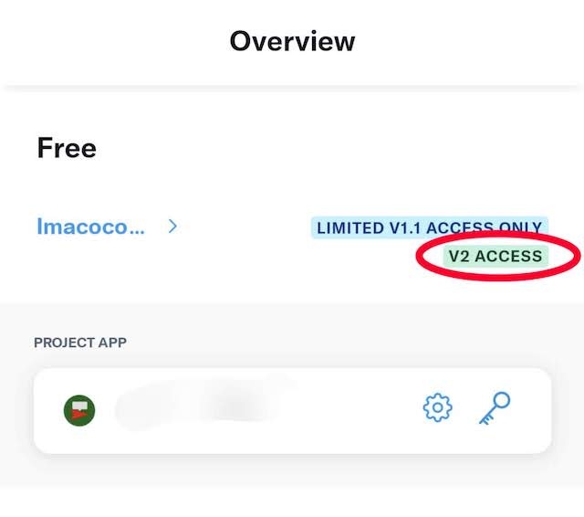
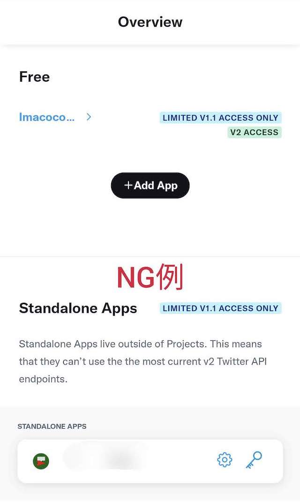
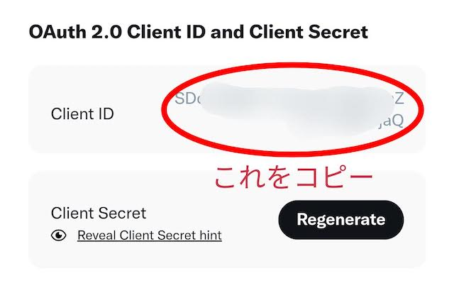

# Twitter APIのカスタムClientの利用
## 背景
2023年にTwitter APIに対する大幅な利用制限がかかるようになり、無料の範囲では1つのアプリについて1日あたり50件までのツイートしかできなくなりました。
これにより、イマココくんの位置情報ツイートについても「イマココくんユーザー全体で1日あたり50件まで」に制限されてしまっています。

この制限を緩和する策として、Twitter APIの自分専用のClient IDを使ってツイートする機能をイマココくんに搭載しました。
以下で案内する手順でTwitter APIのカスタムClientを用意し、そのClient IDをイマココくんに入力することで「イマココくんユーザー全体で1日あたり50件まで」の制限を回避してツイートができるようになります。

## カスタムClient IDの登録手順
### 1. Twitter APIのアプリを作成
[Twitter APIのポータル](https://developer.twitter.com/en/portal/)から、Twitter APIのアプリを作成します。
作成するのは `Free Account` で十分です。Freeでも1日あたり50件のツイートを行うことができます。

作成するアプリの設定で重要なのは以下の2項目です。これら2項目以外は自由に設定して構いません。

- "Type of App"で `Native App (Public client)` を選択する。
- "App info"の "Callback URI / Redirect URL" に以下のURLを追加する。
```text
https://imacocokun.appspot.com/c/callback
```



### 2. V2 APIが有効化されていることを確認
[Twitter APIのアプリ一覧](https://developer.twitter.com/en/portal/projects-and-apps)で、作成したアプリの `V2 ACCESS` が有効になっていることを確認します。



下の画像のように、アプリが `Standalone Apps` のほうにある場合は正しく設定されていないので、その上にある `+Add App` ボタンを押してアプリを追加してください。



### 3. OAuth 2.0 Client IDをイマココくんアプリに登録
作成したTwitter APIの "OAuth 2.0 Client ID and Client Secret" から `Client ID` の値をコピーします。



そして「イマココくん」アプリの設定画面を開き、コピーした値を `カスタムClient ID` に入力してログインします。

以上で設定は完了です。
